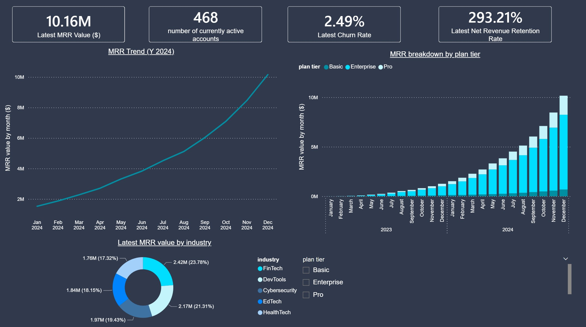
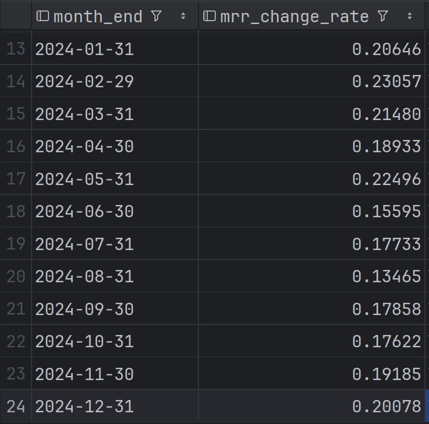
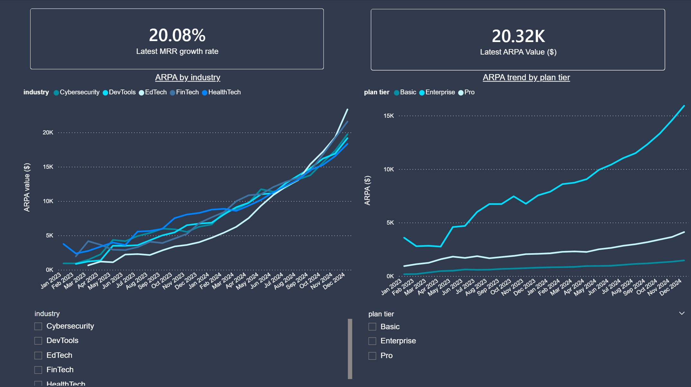
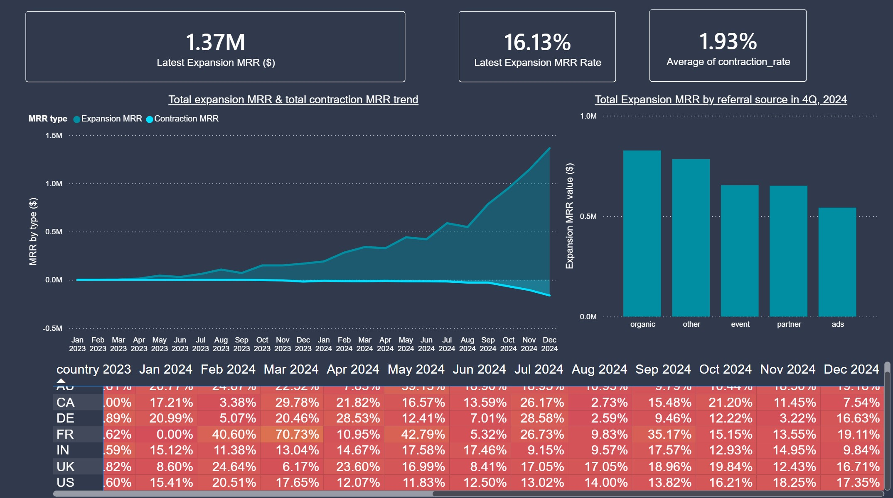
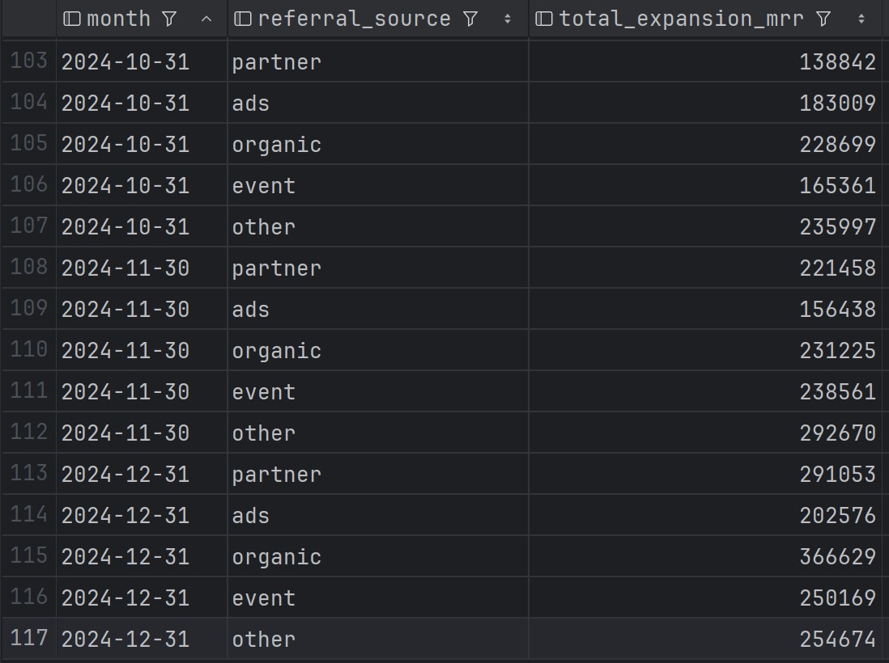
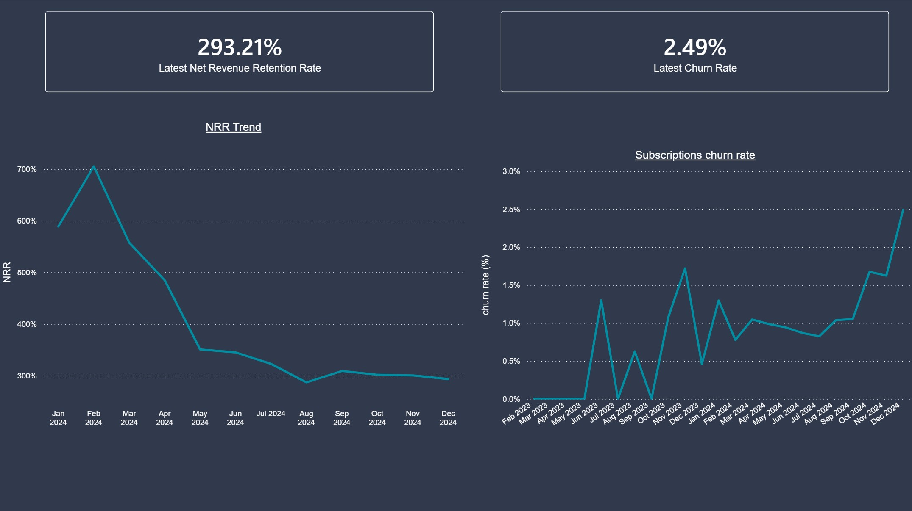

# 🚀 RavenStack SaaS Metrics Analysis Project

### 🔍 B2B SaaS Key Metrics Analysis from Subscription Data

RavenStack is a fictional AI-powered collaboration platform used to simulate
a real-world SaaS business. I cleaned and analyzed RavenStack's accounts,
churn events, and subscription data and implemented key six SaaS metrics using SQL.

- Monthly recurring revenue growth rate (MRR)
- Average revenue per account
- Expansion MRR
- Contraction MRR
- Subscription churn rate
- Net revenue retention

Then, I extracted insights from these metrics and
proposed actionable recommendations.

## 💻 Tech Stack

---
**🖌 *Languages & DB:*** Python (Pandas), SQL (MySQL)

**📈 *Visualization:*** Power BI

**🛠 *Tools:*** DataGrip, VS Code, Git

## 🌊 Project Flow

---

1. Kaggle Dataset <br>
   ⬇
2. Data Cleaning (pandas) <br>
   ⬇
3. SQL Analysis <br>
   ⬇
4. Power BI Dashboard

## 📈 Dashboard & Key Insights

---

### 📊 *1. MRR Growth*



<br> ⭐ Business insights

- in 2024, the MRR growth rate remained steady throughout the year.
  Although the growth rate has declined between Jul and Aug 2024,
  it recovered by the end of the year, reaching 20% growth rate in Dec 2024.
  This consistent growth pattern suggests
  stable customer acquisition.


- While MRR across all the plan tiers has been growing, the Enterprise plan's share of the total MRR remains dominant
  throughout the two-year period.
  <br> The Enterprise tier's dominant MRR contribution reflects a healthy B2B revenue model. Analyzing successful
  Pro-to-Enterprise conversion patterns could help accelerate
  future upselling efforts.


- The MRR distribution across five industries in Dec 2024 is relatively balanced, ranging from HealthTech (17.3%) to
  FinTech (23.8%).
  <br> This suggests that the company has succeeded in constructing a diversified portfolio in terms of which industries
  their clients belong to and should keep
  its current sales & marketing strategy in terms of its industry targets. However, monitoring is recommended as any
  single industry downturn
  could still impact ~20% of total MRR.

### 📊 *2. ARPA*


<br> ⭐ Business insights

- HealthTech is underperforming while EdTech shows strong growth. Upselling initiatives should be prioritized for
  HealthTech accounts.


- Enterprise tier dominates ARPA as expected. However, all three tiers demonstrate steady ARPA growth,
  indicating that the current tier structure and pricing strategy are effective.

### 📊 *3. Expansion & Contraction MRR*



<br> ⭐ Business insights

- Contraction MRR began increasing in Q4 2024, signaling growing customer dissatisfaction. Accounts with high
  contraction values require focused attention from
  Account Management, Customer Success, or Retention Specialist teams.


- Ads channel shows weaker performance in Q4 2024 compared to other channels.
  Both total expansion MRR and MoM expansion MRR growth rate from ads lag behind other channels in Q4 2024.
  This suggests a need to reassess ad spend allocation and overall ads strategy.


- India (IN) and Canada (CA) experienced sharp declines in expansion MRR rate in Dec 2024.
  Potential drivers to investigate include: local economic conditions, local competition, 
  currency fluctuation impact, or region-specific support/onboarding issues.

### 📊 *4. Retention (NRR & Churn Rate)*


<br> ⭐ Business insights

- NRR showed a declining trend in early 2024 but has stabilized since August 2024.


- Subscription churn rate is trending upward. Identifying accounts with multiple
  churned subscriptions could help pinpoint common churn drivers.

## 📁 Repository Structure

---

```aiignore
│  .gitignore
│  README.md
│
├─.idea
│  
├─cleaned_data
│      accounts_cleaned.csv
│      churn_cleaned.csv
│      subscriptions_cleaned.csv
│
├─images
│      ARPA_2.jpg
│      Expansion_Contraction_3.jpg
│      Expansion_Contraction_3_SQL.jpg
│      MRR_1.jpg
│      MRR_1_SQL.jpg
│      Retention_4.jpg
│
├─Power_BI
│      Dashboard.pbix
│
├─python
│  │  data cleaning_account.py
│  │  data cleaning_churn_events.py
│  │  data cleaning_subscriptions.py
│  │  verification_functions.py
│  │
│  └─__pycache__
│          verification_functions.cpython-311.pyc
│
├─raw_data
│      ravenstack_accounts.csv
│      ravenstack_churn_events.csv
│      ravenstack_subscriptions.csv
│      README.md
│
└─sql
        analysis_arpa.sql
        analysis_churn_rate.sql
        analysis_expansion_mrr.sql
        analysis_mrr.sql
        analysis_nrr.sql
        environment_setup.sql
```

## 🔗 Data Source

---
**RavenStack Dataset by River (Kaggle)** <br>
*[Link to dataset](https://www.kaggle.com/datasets/rivalytics/saas-subscription-and-churn-analytics-dataset)*